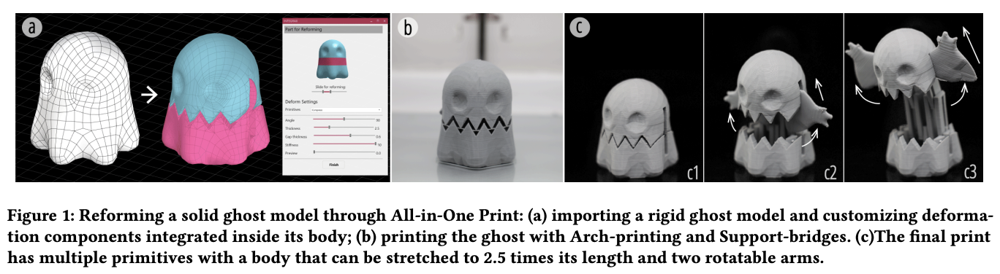
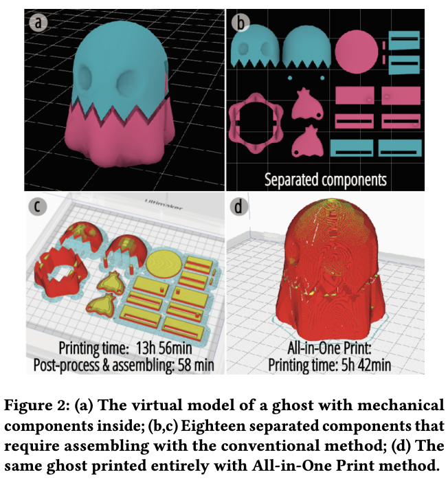
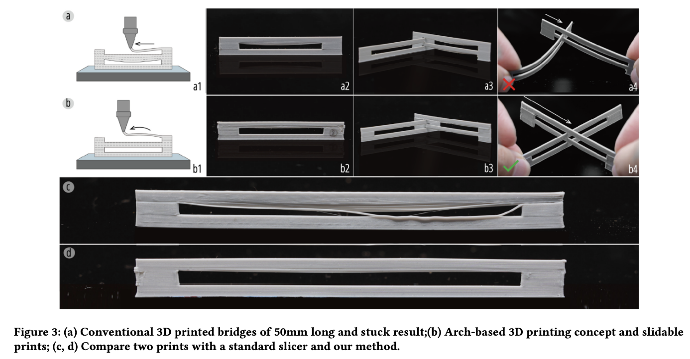

## 3D打印背景知识介绍
3D printing, also known as Additive Manufacturing (AM), is an advanced manufacturing technology that allows the creation of three-dimensional objects by layering or solidifying materials. Here is some background information on 3D printing:

**Working Principle:**

Additive Manufacturing: Unlike traditional subtractive manufacturing methods, 3D printing follows the principle of additive manufacturing, building objects layer by layer.

Digital Model: 3D printing begins with a digital model created using Computer-Aided Design (CAD) software or obtained through 3D scanning of a physical object.

**Main Methods:**

Fused Deposition Modeling (FDM): Utilizes meltable plastic filaments or metal wires, heating and extruding them layer by layer to construct objects.

Stereolithography (SLA) and Digital Light Processing (DLP): Uses ultraviolet light to solidify liquid photosensitive resin layer by layer, forming objects. This includes both SLA and DLP 3D printers.

Powder Bed Fusion: Involves stacking powder layers and using a laser or other energy source to sinter the powder, creating a solid object.

**Materials:**

Plastics: Commonly used in FDM technology, including ABS, PLA, and others.

Metals: Employed in metal 3D printing, such as titanium alloys, stainless steel, and more.

Resins: Used in photopolymerization 3D printing, providing high precision and smooth surfaces.

**Application Fields:**

Manufacturing Industry: Used for prototyping, customized part production, and tool manufacturing.

Medical Field: Applied in producing custom medical devices, organ models, and more.

Construction Industry: Utilized for creating architectural models, prototypes, and even construction components.

Art and Design: Employed for sculpting, creating art pieces, and more.

**Challenges and Future Development:**

Material Selection: Exploring a broader range of printable materials, including novel metal alloys and composite materials.

Printing Speed and Scale: Increasing printing speed and scalability to meet a broader range of application needs.

Standards and Certification: Establishing and adhering to standards in 3D printing to ensure the quality and reliability of printed products.

Sustainability: Addressing environmental concerns and exploring sustainable 3D printing materials and methods.

Medical and Bioprinting: Exploring more applications in the medical field, such as bioprinting organs and tissues.

The continuous development of 3D printing technology brings significant innovation to manufacturing and other industries, offering designers, engineers, and manufacturers a more flexible and efficient production method.

## Test file printing

**Parameter settings**

Quality setting

Speed setting

Intensity setting

**Post-processing - remove supports**

**Post-processing - polishing**

**New 3D printing research**

**All-in-One Print: Designing and 3D Printing Dynamic Objects Using Kinematic Mechanism Without Assembly**

CHI '23 Jiaji Li, Mingming Li, Junzhe Ji, Deying Pan, Yitao Fan, Kuangqi Zhu, Yue Yang, Zihan Yan, Lingyun Sun, Ye Tao, and Guanyun Wang

https://dl.acm.org/doi/abs/10.1145/3544548.3581440

The field of Human-Computer-Interaction (HCI) has been consistently utilizing kinematic mechanisms to create tangible dynamic interfaces and objects. However, the design and fabrication of these mechanisms are challenging due to complex spatial structures, step-by-step assembly processes, and unstable joint connections resulting from the inevitable matching errors within separated parts. In this paper, they propose an integrated fabrication method for one-step FDM 3D printing (FDM3DP) kinematic mechanisms to create dynamic objects without additional post-processing. We describe the Arch-printing and Support-bridges method, which they call All-in-One Print, that compiles given arbitrary solid 3D models into printable kinematic models as G-Code for FDM3DP. To expand the design space, they investigate a series of motion structures (e.g., rotate, slide, and screw) with multi-stabilities and develop a design tool to help users quickly design such dynamic objects. They also demonstrate various application cases, including physical interfaces, toys with interactive aesthetics and daily items with internalized functions.

**Video introduction**

------
