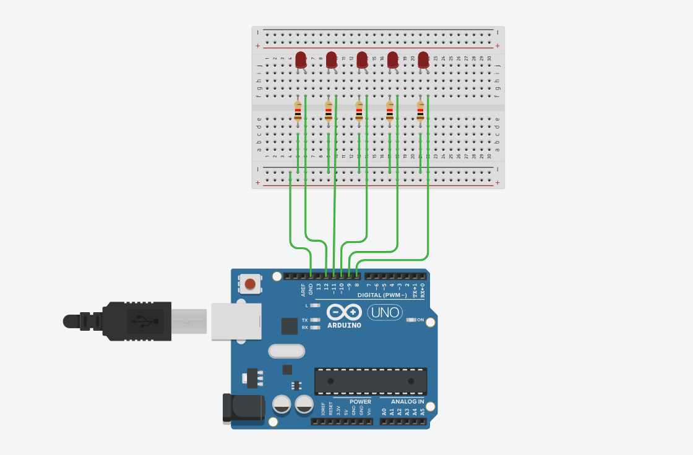
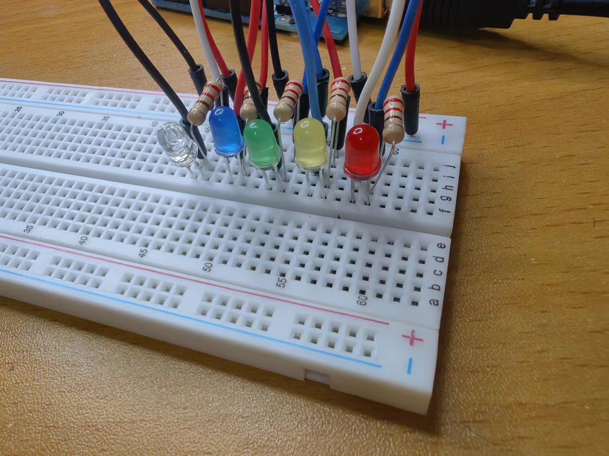
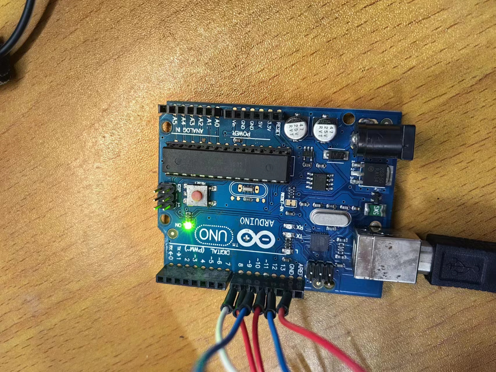
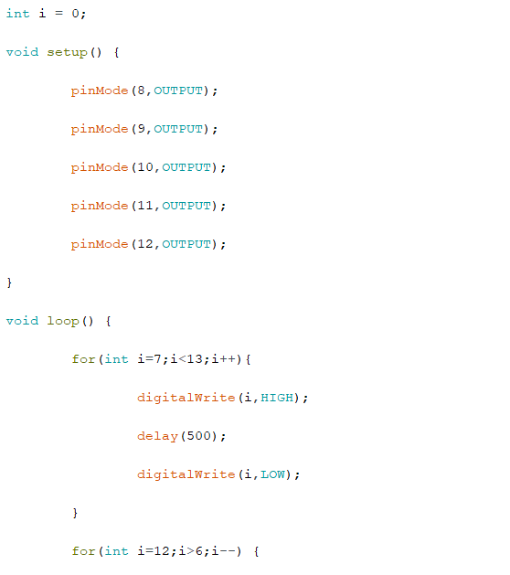

## Early learning of arduino

### Open Source Hardware Learning:

Here are some popular open source hardware platforms, each with unique features and use cases:

1. **Raspberry Pi** : This is a small single-board computer that is widely used for learning programming, making media centers, servers, smart home systems, and more. Raspberry Pi runs a complete operating system (usually Linux-based) with support for several programming languages such as Python, Java, C++, and more.
2. **ESP8266 and ESP32** : These two chips were developed by Espressif Systems. They are ideal for Internet of Things (IoT) projects because they have Wi-Fi capabilities. The ESP32 also supports Bluetooth. These boards are programmed using the Arduino IDE or other programming environment.
3. **BeagleBone** : The BeagleBone is a single-board computer similar to the Raspberry Pi, but it is more focused on real-time and high-performance processing, suitable for more complex projects and industrial applications.
4. **Teensy** : This is an Arduino-based microcontroller development board known for its small size and powerful performance. Suitable for music, art and complex interaction design projects.
5. **Arduino Mega** : This is a more advanced version of the Arduino family with more input/output pins and more memory. Suitable for projects that require a large number of pins or extra memory.
6. **Intel Galileo/Edison** : These are open source computing platforms developed by Intel to make it easier to build the Internet of Things (IoT) and complex embedded projects.

Each platform has its own unique advantages and which one to choose depends on our specific needs, budget and the type of project we are interested in. These platforms often have a wealth of online resources and community support to help us get started learning and making projects.
### Arduino IDE (Integrated Development Environment)

1. **Download and install**:  First, download and install the Arduino IDE from the Arduino official website.
2. **Interface Overview**: 

- Editor : A place to write and edit code.
- Verification button  : Check the code for errors.
- Upload button  : Upload the code to the Arduino board.
- Serial monitor : Displays data and print information from Arduino.

3. **Configuration**: 

- Select Board Type  : Select your Arduino board type in the Tools menu.
- Select Serial Port : Select the serial port connected to the Arduino board.

### Coding basics

1. **Basic structure** : The Arduino program (known as sketch) consists of two main functions:

- 'setup()' : runs once at the beginning of the program to initialize Settings.
- 'loop()' : repeats execution after 'setup()'.

2. **Common functions**  :

- 'pinMode(pin, mode)' : Sets the pin as input or output.
- 'digitalWrite(pin, value)' : Write a HIGH or LOW value to the digit pin.
- 'digitalRead(pin)' : reads the value from the digital pin.
- 'analogRead(pin)' : reads the value (0-1023) from the analog pin.
- 'analogWrite(pin, value)' : Analog output (0-255) to the PWM supported pins.
- 'serial. begin(speed)' : starts Serial communication.
- 'serial.print ()' and 'serial.println ()' : send data to the computer Serial port monitor.

3. **Note** :

- Comment a single line with '//'.
- Use '/*... */ 'Comments multiple lines.

### Physical connection

1. **Connect the Arduino** : Connect the Arduino board to the computer using a USB cable.
2. **Circuit principle**  :

- **Using breadboards**  : Breadboards are used to temporarily build circuits without welding.
- **Connecting components  :** such as LED, resistor, button, etc. Pay attention to the use of resistors to avoid short circuits or component damage.

3. **Basic Circuit experiment  :**

- **LED flashing ** : Connect the positive LED to the digital pin of the Arduino and the negative LED to GND (ground) through a resistor.
- **Read button status  :** Connect one end of the button to the digital pin and the other end to GND, read the status through 'digitalRead'.


##  Flow lamp experiment

#### Experiment preparation

##### Learning by principle：

 Connect to the LED through Arduino I/O, set the interface to output mode, the high level LED light is on, the low level LED light is off, the on-off time is controlled by delay, and the on-off of the LED light visually forms a blinking state or a flowing state. The proposed effect can be realized by writing programs to control the state and delay of the LED output.

##### Code part learning - program control statements

for loop statement:

for (expression 1; Expression 2; Expression 3)

{statement block;

}

#### Hardware connection diagram

A 220Ω current limiting resistor is connected in series between the LED negative electrode and the ArduinoGND pin to limit the excessive current and protect the safety of the motherboard and diode. Other leds are positively connected to 8-12 pins.




实物连接：





 

#### Code section
First of all, pin 8-12 is set as output, and then in the main program structure part through the loop statement to achieve the effect of water lamp, the first loop structure to make pin 8-12 high potential in turn, after a delay of 500 milliseconds to low potential, i reached 12 after jumping out of the first cycle structure, into the next cycle structure. The second loop allows pins 12-8 to be successively high-potential, with a delay of 500 ms before becoming low-potential.

The resulting flow light effect is that the lights of 8-12 turn on for 500 milliseconds successively, and then turn on for 500 milliseconds successively from 12-8. Continuous cycle


```
int i = 0;

void setup() {

 

​    pinMode(8,OUTPUT);

​    pinMode(9,OUTPUT);

​    pinMode(10,OUTPUT);

​    pinMode(11,OUTPUT);

​    pinMode(12,OUTPUT);

}

 

void loop() {

 

​    for(int i=7;i<13;i++){

​        digitalWrite(i,HIGH);

​        delay(500);

​        digitalWrite(i,LOW);

​    }

​    for(int i=12;i>6;i--) {

​        digitalWrite(i,HIGH);

​        delay(500);

​        digitalWrite(i,LOW);

​    }

 

}
```

Arduino code interface：



 


#### Demo video

