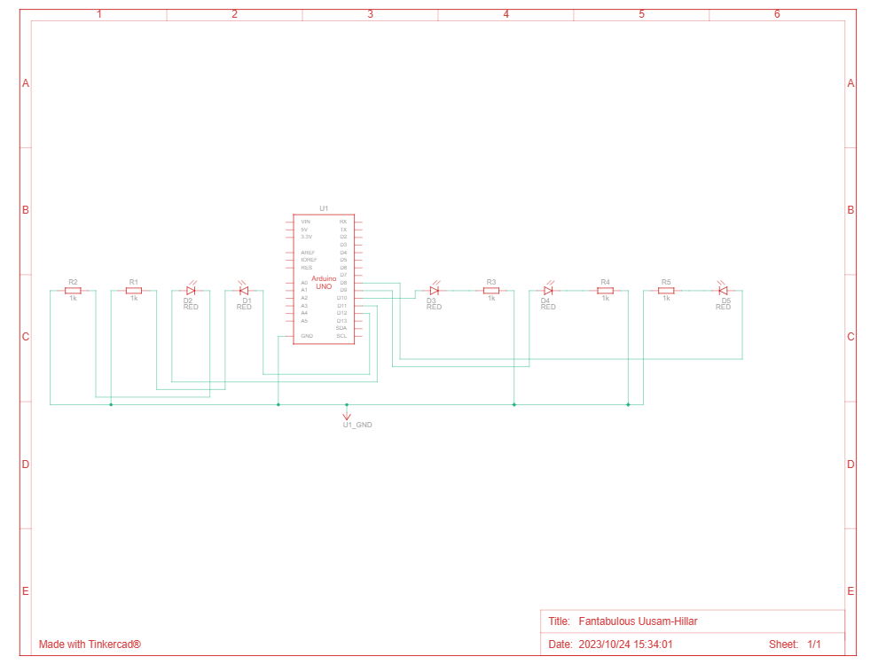
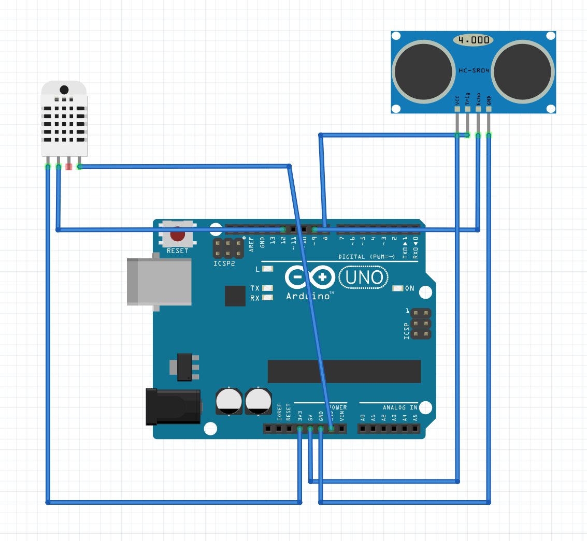
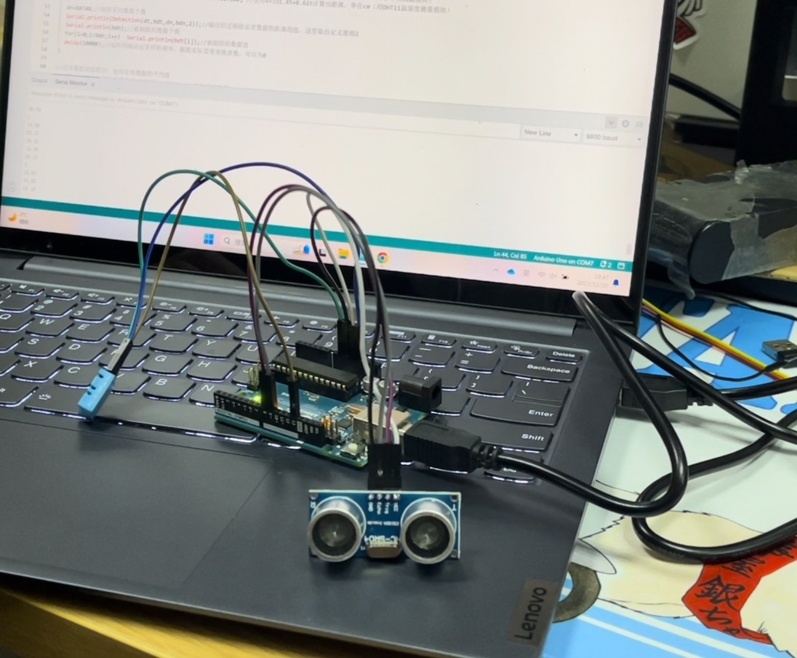

## Early learning of arduino

### Open Source Hardware Learning:

Here are some popular open source hardware platforms, each with unique features and use cases:

1. **Raspberry Pi** : This is a small single-board computer that is widely used for learning programming, making media centers, servers, smart home systems, and more. Raspberry Pi runs a complete operating system (usually Linux-based) with support for several programming languages such as Python, Java, C++, and more.
2. **ESP8266 and ESP32** : These two chips were developed by Espressif Systems. They are ideal for Internet of Things (IoT) projects because they have Wi-Fi capabilities. The ESP32 also supports Bluetooth. These boards are programmed using the Arduino IDE or other programming environment.
3. **BeagleBone** : The BeagleBone is a single-board computer similar to the Raspberry Pi, but it is more focused on real-time and high-performance processing, suitable for more complex projects and industrial applications.
4. **Teensy** : This is an Arduino-based microcontroller development board known for its small size and powerful performance. Suitable for music, art and complex interaction design projects.
5. **Arduino Mega** : This is a more advanced version of the Arduino family with more input/output pins and more memory. Suitable for projects that require a large number of pins or extra memory.
6. **Intel Galileo/Edison** : These are open source computing platforms developed by Intel to make it easier to build the Internet of Things (IoT) and complex embedded projects.

Each platform has its own unique advantages and which one to choose depends on our specific needs, budget and the type of project we are interested in. These platforms often have a wealth of online resources and community support to help us get started learning and making projects.
### Arduino IDE (Integrated Development Environment)

1. **Download and install**:  First, download and install the Arduino IDE from the Arduino official website.
2. **Interface Overview**: 

- Editor : A place to write and edit code.
- Verification button  : Check the code for errors.
- Upload button  : Upload the code to the Arduino board.
- Serial monitor : Displays data and print information from Arduino.

3. **Configuration**: 

- Select Board Type  : Select your Arduino board type in the Tools menu.
- Select Serial Port : Select the serial port connected to the Arduino board.

### Coding basics

1. **Basic structure** : The Arduino program (known as sketch) consists of two main functions:

- `setup()` : runs once at the beginning of the program to initialize Settings.
- `loop()` : repeats execution after 'setup()'.

2. **Common functions**  :

- `pinMode(pin, mode)` : Sets the pin as input or output.
- `digitalWrite(pin, value)` : Write a HIGH or LOW value to the digit pin.
- `digitalRead(pin)` : reads the value from the digital pin.
- `analogRead(pin)` : reads the value (0-1023) from the analog pin.
- `analogWrite(pin, value)` : Analog output (0-255) to the PWM supported pins.
- `serial. begin(speed)` : starts Serial communication.
- `serial.print ()` and `serial.println ()` : send data to the computer Serial port monitor.

3. **Note** :

- Comment a single line with '//'.
- Use '/*... */ 'Comments multiple lines.

### Physical connection

1. **Connect the Arduino** : Connect the Arduino board to the computer using a USB cable.
2. **Circuit principle**  :

- **Using breadboards**  : Breadboards are used to temporarily build circuits without welding.
- **Connecting components  :** such as LED, resistor, button, etc. Pay attention to the use of resistors to avoid short circuits or component damage.

3. **Basic Circuit experiment  :**

- **LED flashing ** : Connect the positive LED to the digital pin of the Arduino and the negative LED to GND (ground) through a resistor.
- **Read button status  :** Connect one end of the button to the digital pin and the other end to GND, read the status through 'digitalRead'.


##  Flow lamp experiment

#### Experiment preparation

##### Learning by principle：

 Connect to the LED through Arduino I/O, set the interface to output mode, the high level LED light is on, the low level LED light is off, the on-off time is controlled by delay, and the on-off of the LED light visually forms a blinking state or a flowing state. The proposed effect can be realized by writing programs to control the state and delay of the LED output.

##### Code part learning - program control statements

for loop statement:

for (expression 1; Expression 2; Expression 3)

{statement block;

}

#### Hardware connection diagram

A 220Ω current limiting resistor is connected in series between the LED negative electrode and the ArduinoGND pin to limit the excessive current and protect the safety of the motherboard and diode. Other leds are positively connected to 8-12 pins.




实物连接：


 

#### Code section
First of all, pin 8-12 is set as output, and then in the main program structure part through the loop statement to achieve the effect of water lamp, the first loop structure to make pin 8-12 high potential in turn, after a delay of 500 milliseconds to low potential, i reached 12 after jumping out of the first cycle structure, into the next cycle structure. The second loop allows pins 12-8 to be successively high-potential, with a delay of 500 ms before becoming low-potential.

The resulting flow light effect is that the lights of 8-12 turn on for 500 milliseconds successively, and then turn on for 500 milliseconds successively from 12-8. Continuous cycle


```
int i = 0;

void setup() {

 

​    pinMode(8,OUTPUT);

​    pinMode(9,OUTPUT);

​    pinMode(10,OUTPUT);

​    pinMode(11,OUTPUT);

​    pinMode(12,OUTPUT);

}

 

void loop() {

 

​    for(int i=7;i<13;i++){

​        digitalWrite(i,HIGH);

​        delay(500);

​        digitalWrite(i,LOW);

​    }

​    for(int i=12;i>6;i--) {

​        digitalWrite(i,HIGH);

​        delay(500);

​        digitalWrite(i,LOW);

​    }

}

```

Arduino code interface：


 


#### Demo video


##  Arduino Input

### Reference：
https://blog.csdn.net/m0_61543203/article/details/127185686?ops_request_misc=&request_id=&biz_id=102&utm_term=Arduino%E8%B6%85%E5%A3%B0%E6%B3%A2%E6%B5%8B%E8%B7%9D&utm_medium=distribute.pc_search_result.none-task-blog-2~all~sobaiduweb~default-5-127185686.nonecase&spm=1018.2226.3001.4187

### Function & Experiment component

In practical applications, when using HC-SR04 for distance measurement, the maximum measurement error comes from the interference of the environment on ultrasound. If you want to obtain more accurate results, it is best to add a temperature measurement module. For example, factors such as refraction caused by uneven surface of the object being measured, and even water vapor in the air can cause significant deviations in the sampling data we obtain. To solve this problem, we must remove some abnormal data sampled. This program uses the Wright and Grabbs criteria to remove these abnormal data, so that we can obtain more accurate distance measurement values.

Component：Arduino UNO kit, Arduino IDE, computer, ultrasonic sensor, temperature and humidity measurement module DHT11 code

### Code

```
/* 
  超声波传感器HC-SR04测距：
 触发信号trig：触发高电平脉冲大于10us
 反馈信号echo：返回的高电平长度就是距离的us数字
 通过声波速度和采集到的时间计算出距离。
 测量数据处理方法为：每循环一次，采样20次，然后对这20个获得的数据进行异常数据的剔除，
 再由剩余的数据求得平均值，作为最后的距离值。 
 */
 #include <DHT.h>

#define DHTPIN 13    // 替换成你的 DHT 连接的引脚
#define DHTTYPE DHT11   // 替换成你使用的 DHT 型号
DHT dht(DHTPIN, DHTTYPE);
/*#include "DHT.h"
DHT dht;*/
const int DATAN=20; //每组处理测试数据的个数
 
// 引脚定义
const int trig = 8;    // 触发信号
const int echo = 9;    // 反馈信号
const int DHTPin =  12; // 定义DHTPin连接的引脚为D12
float thtmp; //存储温度值
 
double dt[DATAN];//存放一组从SR04读取的距离数据
double bdt[DATAN];//存放一组被剔除的数据
int dn;//每组处理测试数据个数，Detection返回时为有效数据个数
int bdn;//某组被剔除的数据个数
 
//初始化
void setup() {
  pinMode(echo, INPUT);//SR04的反馈端口echo设置为输入
  pinMode(trig, OUTPUT);//SR04的触发端口trig设置为输出
  pinMode(DHTPin, INPUT);  //设置DHT11的数据读入DHTPin    
  //dht.setup(DHTPin); // 设置DHT11数据传输的引脚
  Serial.begin(9600);
}
 
//主循环
void loop() {
  long IntervalTime=0; //定义一个时间变量
  int i=0;
  thtmp=(float) dht.readTemperature(); //从DHT11读取温度
  Serial.println(thtmp);//通过串口输出温度
  for(i=0;i<DATAN;i++) //进行一组数据，20（DATAN）次采样，并进行计算后送dt[0]—dt[19]
  {  
    digitalWrite(trig, 1);//置高电平
    delayMicroseconds(15);//延时15us
    digitalWrite(trig, 0);//设为低电平
    IntervalTime=pulseIn(echo, HIGH);//用自带的函数采样反馈的高电平的宽度，单位us
    if (isnan(thtmp)) dt[i]=0.0173*IntervalTime; //使用摄氏25C°时的声速约为346m/s计算出距离，单位cm（若不用测温模块）
    else dt[i]=(331.45+0.61*thtmp)/20000.00*IntervalTime; //使用v=331.45+0.61t计算出距离，单位cm（用DHT11温湿度测量模块）
  }
  dn=DATAN;//每组采用数据个数
  Serial.println(Detection(dt,bdt,dn,bdn,2));//输出经过剔除误差数据的距离均值，这里取自定义准则2
  Serial.println(bdn);//被剔除的数据个数
  for(i=0;i<bdn;i++)  Serial.println(bdt[i]);//被剔除的数据值
  delay(10000);//延时间隔决定采样的频率，根据实际需要变换参数，可以为0
}
 
//误差数据剔除程序，返回有效数据的平均值
//参数data输入为原始测量数据，返回时，前datanum个为有效数据
//参数baddata无输入数据，输出为被剔除的数据
//参数datanum输入为原始测量数据个数
//参数badnum无输入数据，输出为剔除的数据个数
//参数rule为莱特or格拉布斯准则选择，3为莱特准则，4为格拉布斯95%，5为格拉布斯99%，小于3为自定义准则
double Detection(double data[],double baddata[],int datanum,int &badnum,int rule)
{
  double data_b[datanum];//临时存放保留的数据
  double v[datanum]; //残差
  double g95[]={1.15,1.46,1.67,1.82,1.94,2.03,2.11,2.18,2.23,2.29,2.33,2.37,2.41,2.44,2.47,2.50,2.53,2.56,2.58,2.60,2.62,2.64,2.66,2.74,2.81,2.87,2.96,3.17};//格拉布斯95%
  double g99[]={1.16,1.49,1.75,1.94,2.10,2.22,2.32,2.41,2.48,2.55,2.61,2.66,2.71,2.75,2.79,2.82,2.85,2.88,2.91,2.94,2.96,2.99,3.01,3.10,3.18,3.24,3.34,3.58};//格拉布斯99%
  double bsl; //贝塞尔公式结果
  double maxdev; //有效的莱特 or 格拉布斯准则的最大偏差
  double sum; //累加临时存储
  double average; //平均值
  int badindex;//某次剔除数据数
  int validNum=0;//有效数据数
  int proindex=0;//循环的次数
  double lg;//莱特 or 格拉布斯准则的系数
  int i;
  if (rule<=3) //当rule小于等于3时，直接用莱特系数3或自定义的rule值
    lg=rule;
  else if(rule>5) //当rule大于5时，强制设为莱特准则
    lg=3;
  badnum=0;
  while(1)
  {
    if(rule==4) //格拉布斯95%
    {
      if(datanum>=100) lg=g95[27];//数据个数大于100个时
      else if(datanum>=50) lg=g95[26];
      else if(datanum>=40) lg=g95[25];
      else if(datanum>=35) lg=g95[24];
      else if(datanum>=30) lg=g95[23];
      else if(datanum>=25) lg=g95[22];
      else lg=g95[datanum-3];
    }
    else if(rule==5)//格拉布斯99%
    {
      if(datanum>=100) lg=g99[27];
      else if(datanum>=50) lg=g99[26];
      else if(datanum>=40) lg=g99[25];
      else if(datanum>=35) lg=g99[24];
      else if(datanum>=30) lg=g99[23];
      else if(datanum>=25) lg=g99[22];
      else lg=g99[datanum-3];
    }
    proindex++;
    sum=0;
    for(i=0;i<datanum;i++)
      sum+=data[i];
    average=sum/datanum; //计算平均值
    sum=0;
    for(i=0;i<datanum;i++)
    {
      v[i]=data[i]-average; //计算残差
      sum+=v[i]*v[i]; //计算残差平方和
    }
    bsl=sqrt(sum/(datanum-1)); //计算贝塞尔公式标准差
    maxdev=lg*bsl; //计算最大偏差
    //剔除坏值，即剔除粗差数据
    validNum=0;
    badindex=0;
    for(i=0;i<datanum;i++)
      if(fabs(v[i])>=maxdev && maxdev!=0) //当|Vi|>准则偏差值时
      {
        baddata[badnum++]=data[i];//将该Xi作为粗差数据，放入坏数据数组
        badindex++;
      }
      else data_b[validNum++]=data[i];//否则将效数数据暂存到data_b数组
        for(i=0;i<validNum;i++) //将暂存的效数数据送回数据数组data
          data[i]=data_b[i];
    datanum=validNum;//将当前有效数据个数作为数据个数
    if(datanum>5)//有效数据大于5个，则继续进行处理
    {
      if(badindex==0) //若没有可剔除的粗差数据
        break;//跳出循环，即粗差数据处理完毕
    }
    else break;//有效数据小于等于5个，直接跳出循环
  }
  return average;//子程序返回有效数据的均值
}

```

### Fritzing circuit stimulation



### Physical image



### Video


