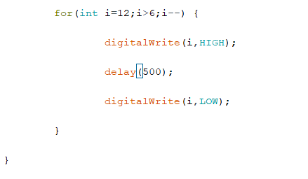

## 一、   开源学习

## 二、   Arduino学习

## 三、   流水灯实验

#### 实验准备

##### 原理学习：

 通过Arduino I/O接入LED，设置接口为输出模式，高电平LED灯点亮、低电平LED灯熄灭，亮灭的时长由延时控制，LED灯的亮灭在视觉上形成闪烁状态或流动状态，通过编写程序控制LED输出的状态与延时，实现构想的效果。

##### 代码部分学习——程序控制语句

for循环语句：

 for (表达式1；表达式2；表达式3)

 {语句块；

​      }

#### 硬件连接示意图

LED发光二极管负极与ArduinoGND引脚间串联一个220Ω限流电阻，限制电流过大，保护主板与二极管的安全。其他LED分别正极连接8-12引脚。


实物连接：


 

#### 代码部分
首先将8-12引脚设置为输出，然后在主程序结构部分通过循环语句来达到流水灯的效果，第一个循环结构让8-12引脚依次高电位，延迟500毫秒后变为低电位，i到达12后跳出第一循环结构，进入下一个循环结构。第二个循环结构让12-8引脚依次高电位，延迟500毫秒后变为低电位。

达到的流水灯效果是，8-12号的灯依次亮500毫秒，然后从12-8依次亮500毫秒。一直循环


```
int i = 0;

void setup() {

 

​    pinMode(8,OUTPUT);

​    pinMode(9,OUTPUT);

​    pinMode(10,OUTPUT);

​    pinMode(11,OUTPUT);

​    pinMode(12,OUTPUT);

}

 

void loop() {

 

​    for(int i=7;i<13;i++){

​        digitalWrite(i,HIGH);

​        delay(500);

​        digitalWrite(i,LOW);

​    }

​    for(int i=12;i>6;i--) {

​        digitalWrite(i,HIGH);

​        delay(500);

​        digitalWrite(i,LOW);

​    }

 

}
```

Arduino代码界面：


 



#### 演示视频

