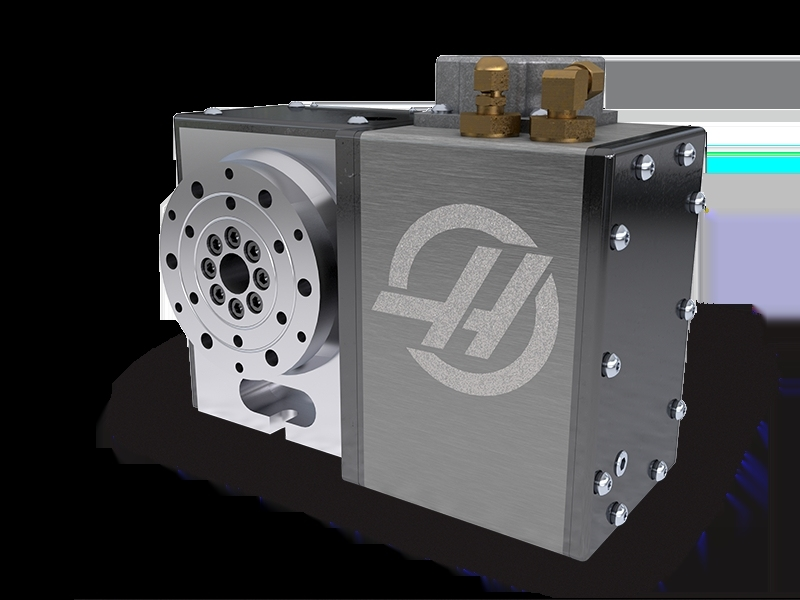
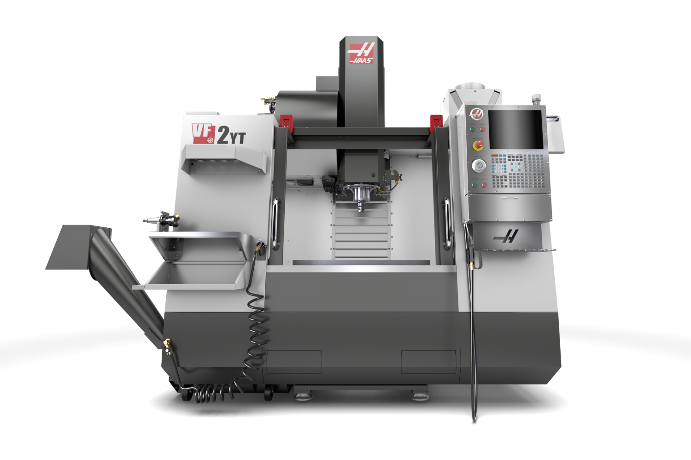
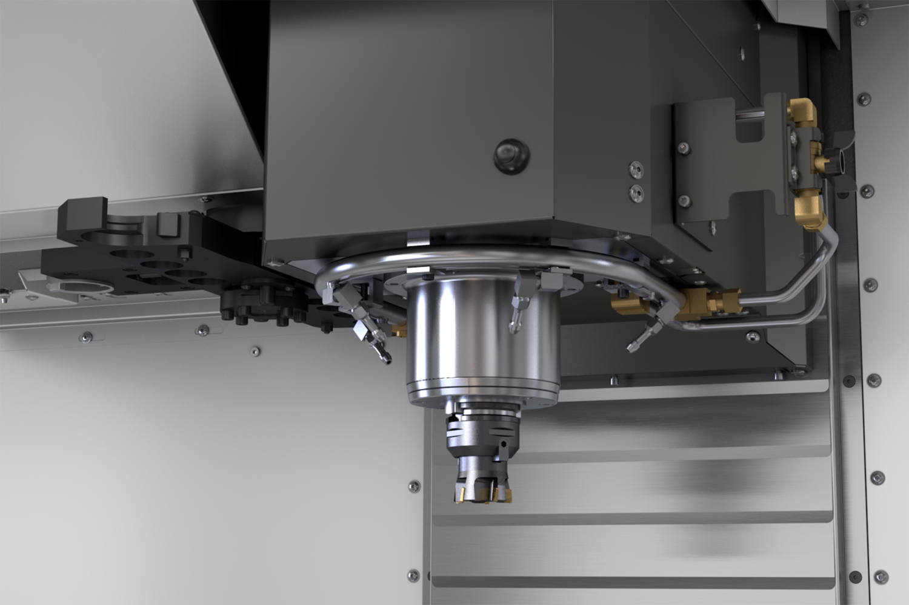
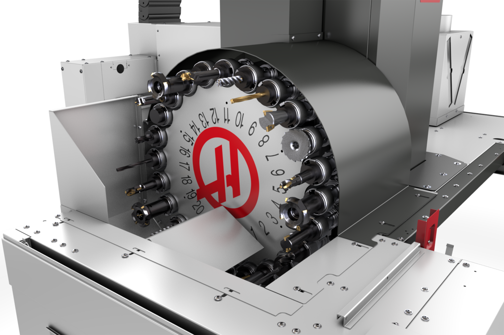

## Tools

------

**Autodesk Fusion 360:**

Use Autodesk Fusion360 to achieve modeling, assembly and simulation.
Refer to tutorial and resource:
https://www.youtube.com/watch?v=CGvCVKpWtB4&list=PLOnuAwx8d0-m3heu6Xkt_qpYsn_YbXy1P&index=2

## Overview

Overview of output model effects.

<iframe src="https://myhub.autodesk360.com/ue28cacf9/shares/public/SH512d4QTec90decfa6e96e25f71c5c64af1?mode=embed" width="1024" height="768" allowfullscreen="true" webkitallowfullscreen="true" mozallowfullscreen="true"  frameborder="0"></iframe>

## Process

------

#### **1. Gear modeling**

Build gear using plugin Supergear.

#### **2. Hollow cylindrical structure modeling**

Draw model wireframes and then extrude.

#### **3. Joint the gears to achieve rotation**

Select join point.

#### **4. Joint the hollow cylindrical structure to achieve sliding**

Set movement direction and adjust position.

#### **5.Enable contact sets**

Create a new contact set-select the component-preview the animation model.

### **6. Overall effect preview of this part**

## Introduce of another CAD software
数控转台是一种用于机械加工的设备，它可以通过电脑控制来实现工件在不同方向上的旋转和定位。数控转台通常由转台主轴、伺服电机、编码器、控制系统等组成。它广泛应用于机械加工领域，特别是在数控机床、激光加工、雕刻等领域中起着重要作用。数控转台可以实现高精度的定位和旋转，提高加工效率和精度。

数控转台的主要特点和功能包括：

1. 电脑控制：数控转台可以通过电脑控制，实现精确的定位和旋转操作。
2. 多方向旋转：数控转台可以在不同方向上进行旋转，包括水平轴和铅垂轴的旋转。
3. 高精度定位：数控转台可以实现高精度的定位，最小增量可以达到0.001度。
4. 提高加工效率：数控转台可以实现自动化操作，提高加工效率和生产效率。
5. 提高加工精度：数控转台的高精度定位和旋转功能可以提高加工精度，保证产品质量。

以下是较新的数控转台型号和技术：

1. HRT100 (https://www.haascnc.com/zh/machines/rotaries-indexers/rotary-tables/models/hrt100.html)

超紧凑型HRT100旋转工作台为在Haas CM-1紧凑型铣床和其他小型机床上加工小零件提供高速、精确的定位和全4轴运动。单元非常小的尺寸和重量轻，使其成为完美的4轴解决方案。

2.VF-2YT-V(https://www.haascnc.com/machines/vertical-mills/vf-series/models/small/vf-2yt-v.html)

-大功率直接传动主轴
-30+1侧装工具更换器
-可根据需要定制

------
