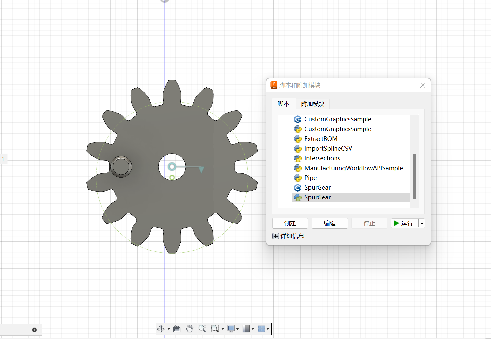
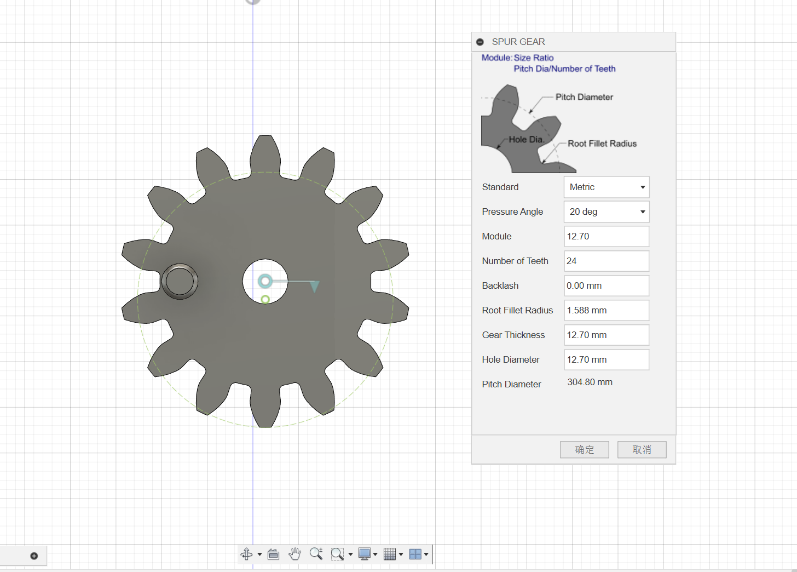
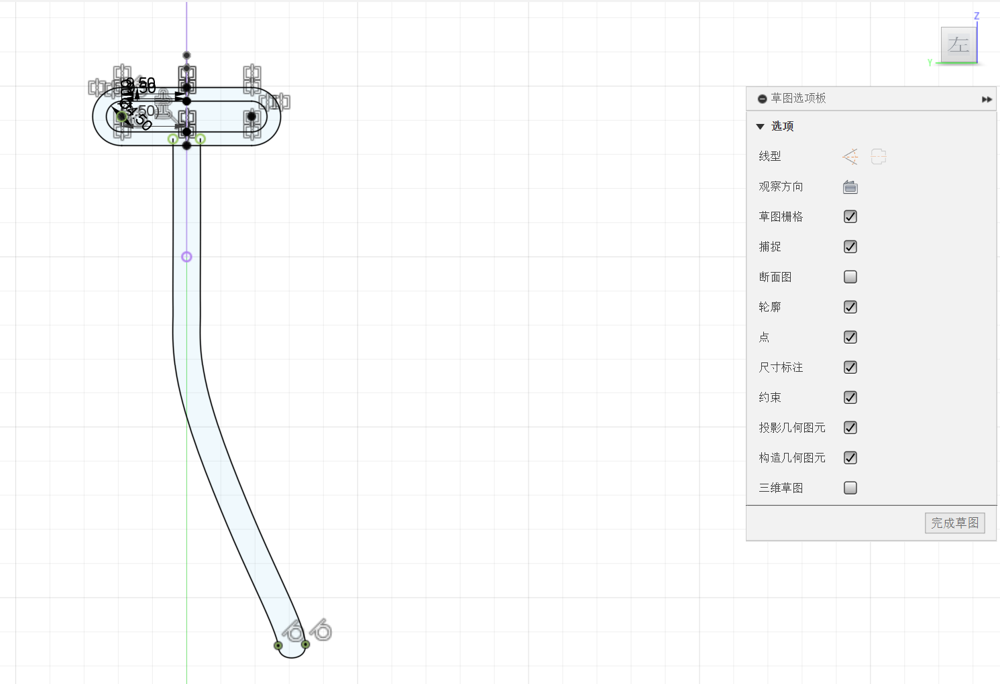
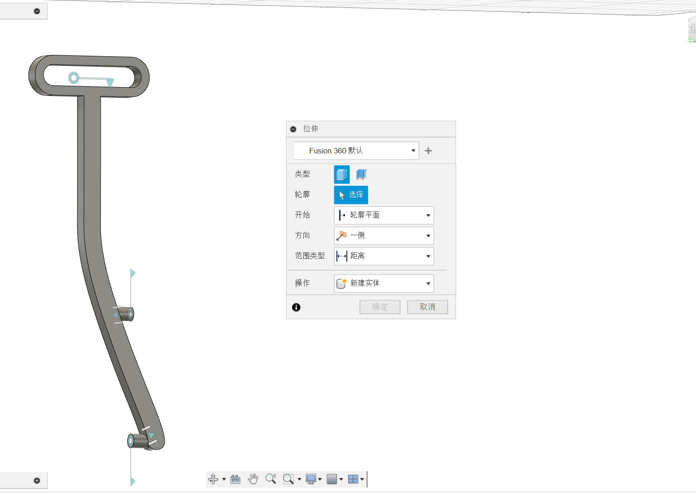
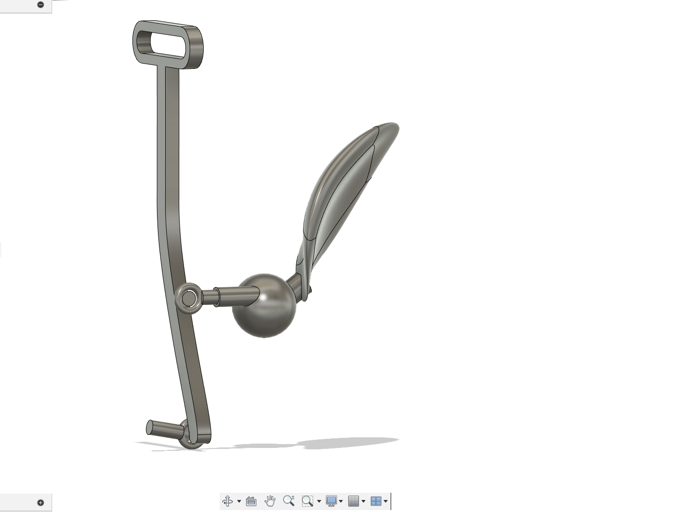
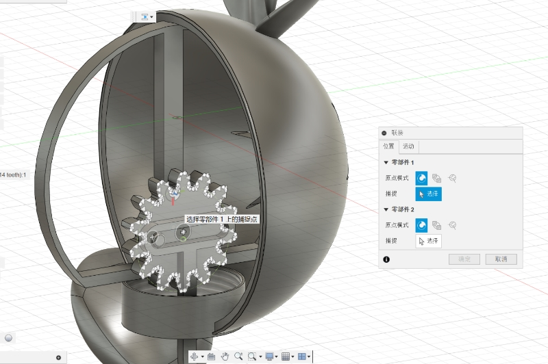
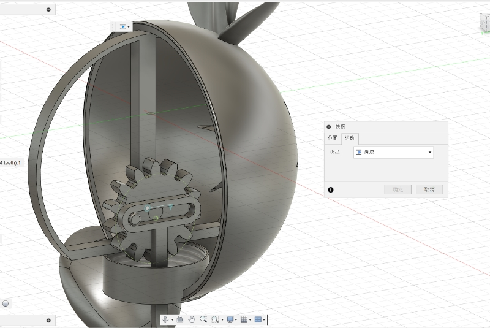
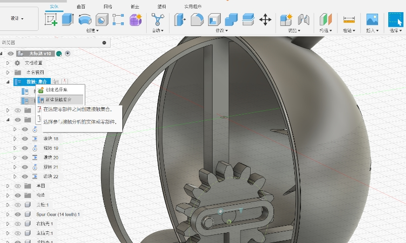
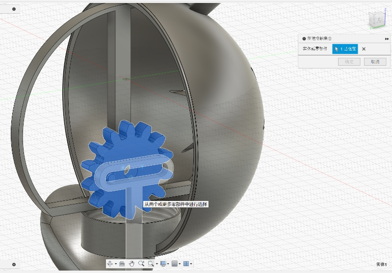
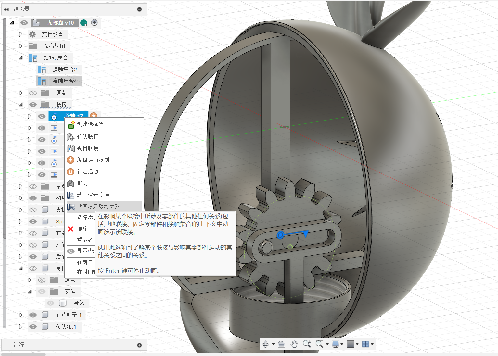

## Tools

------

**Autodesk Fusion 360:**

Use docsify to dynamically convert Markdown files to html files

Refer to tutorials and resources:

https://www.youtube.com/watch?v=CGvCVKpWtB4&list=PLOnuAwx8d0-m3heu6Xkt_qpYsn_YbXy1P&index=2

## Overview

Overview of output model effects

## Process

------

#### **1. Gear modeling**

Build gear using plugin Supergear.

#### **2. Hollow cylindrical structure modeling**

Draw model wireframes and then extrude.

#### **3. Joint the gears to achieve rotation**

Select join point.

#### **4. Connect the hollow cylindrical structure to achieve sliding**

Set movement direction and adjust position.

#### **5.Enable contact sets**

Create a new contact set-select the component-preview the animation model.

### **6. Overall effect preview of this part**

------
