## Tools

------

**Autodesk Fusion 360:**

Use Autodesk Fusion360 to achieve modeling, assembly and simulation.
Refer to tutorial and resource:
https://www.youtube.com/watch?v=CGvCVKpWtB4&list=PLOnuAwx8d0-m3heu6Xkt_qpYsn_YbXy1P&index=2

## Overview

Overview of output model effects.

<iframe src="https://myhub.autodesk360.com/ue28cacf9/shares/public/SH512d4QTec90decfa6e96e25f71c5c64af1?mode=embed" width="1024" height="768" allowfullscreen="true" webkitallowfullscreen="true" mozallowfullscreen="true"  frameborder="0"></iframe>

## Process

------

#### **1. Gear modeling**

Build gear using plugin Supergear.

#### **2. Hollow cylindrical structure modeling**

Draw model wireframes and then extrude.

#### **3. Joint the gears to achieve rotation**

Select join point.

#### **4. Joint the hollow cylindrical structure to achieve sliding**

Set movement direction and adjust position.

#### **5.Enable contact sets**

Create a new contact set-select the component-preview the animation model.

#### **Plug-in use：Calling external plugins**

Find plugins

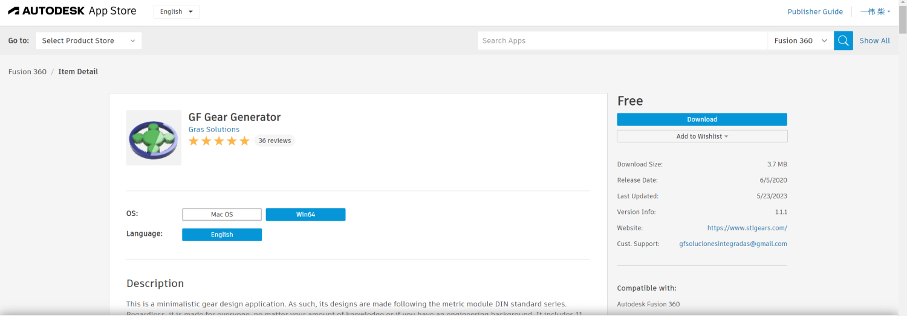

Plugin Details Description

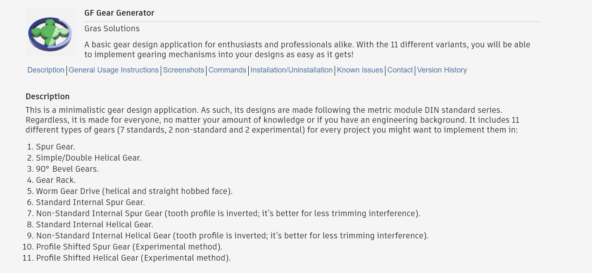

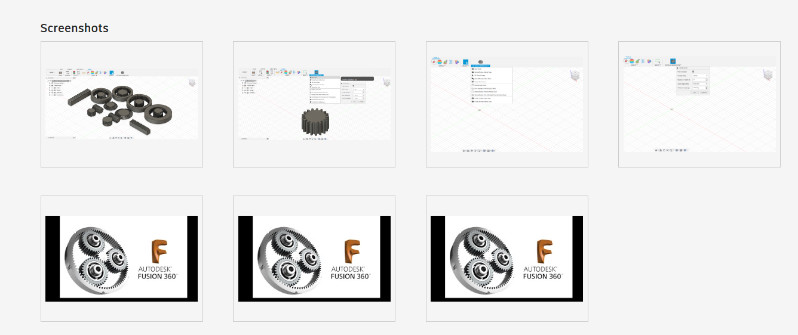

Plugin loading

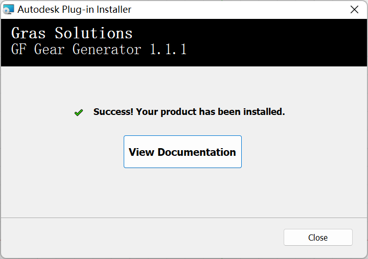

Plugin call

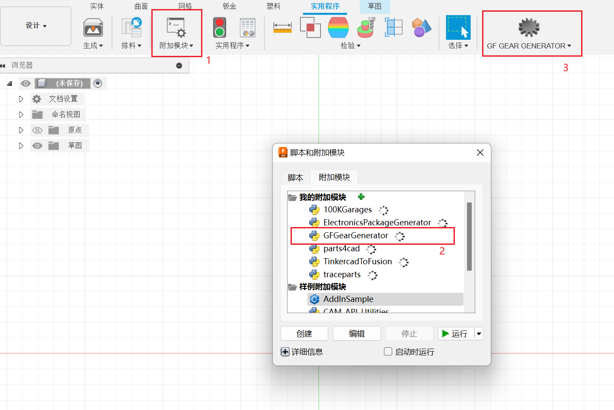

Plugin usage

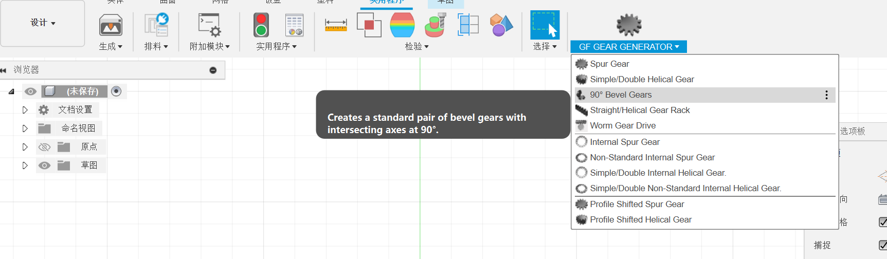

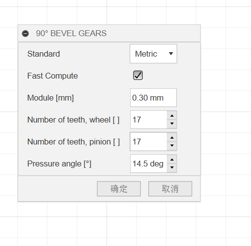

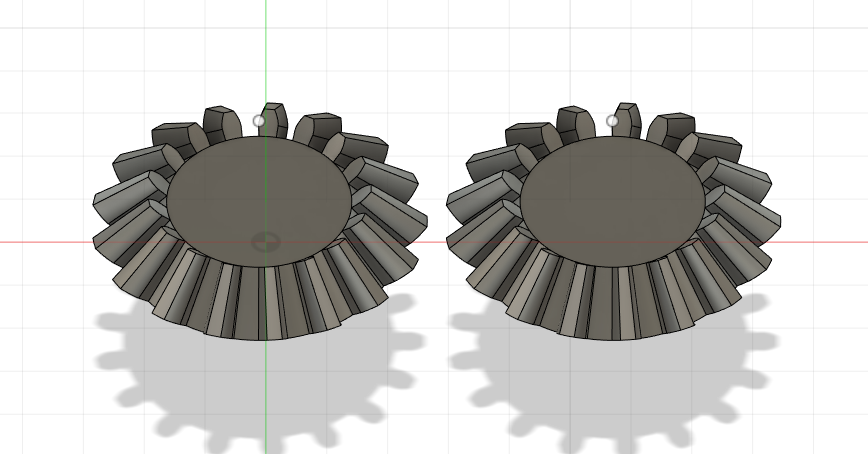

#### **6. Overall effect preview of this part**

## CAD Software introduction

**Introduction**

SketchUp is a 3D modeling software that allows users to create and manipulate 3D models of buildings, landscapes, furniture, and other objects. It is commonly used in architecture and interior design.

SketchUp is owned by Trimble Inc. The program is currently available as a web-based application, SketchUp Free, and three paid subscriptions, SketchUp Shop, SketchUp Pro, and SketchUp Studio, each with increasing functionality.

The program includes drawing layout functionality, surface rendering in different "styles", and enables placement of its models within Google Earth.

The program includes drawing layout functionality, surface rendering in different "styles", and enables placement of its models within Google Earth.

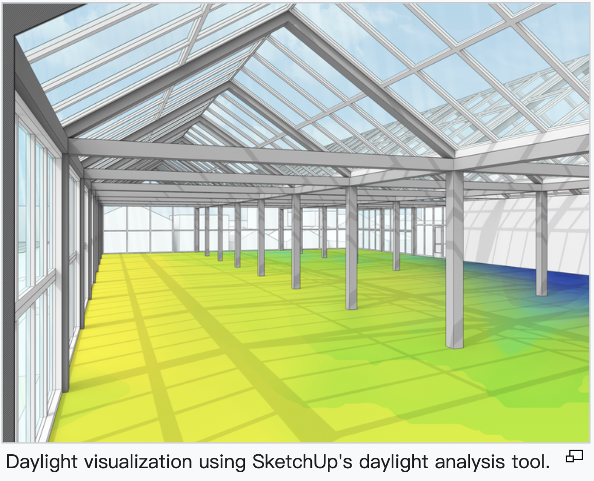

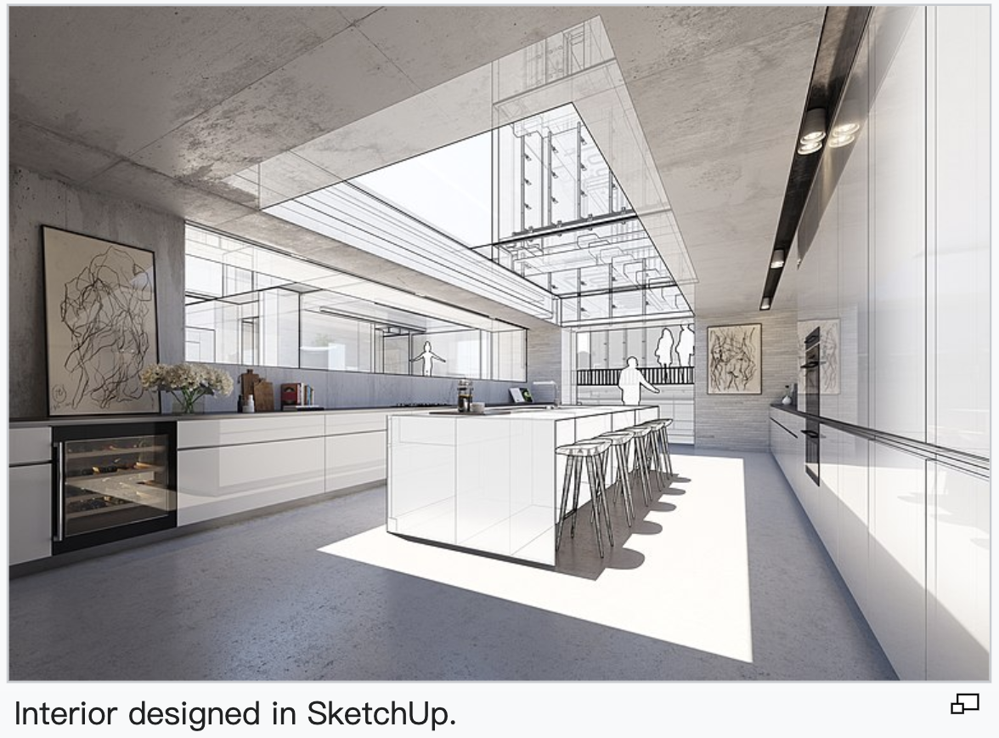

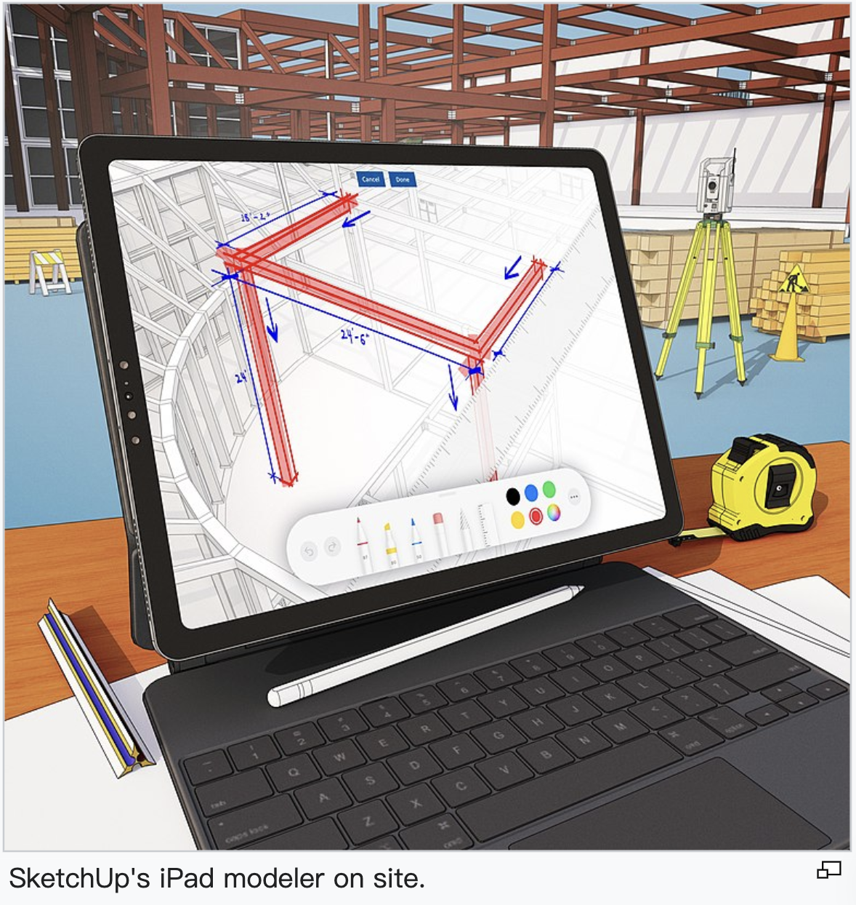

**Tool**

1. Drawing tools

Straight Line - Used to draw a straight line.

Arc - Creates an arc with two points and one drag, or a third click.

Freehand Drawing - Allows the user to draw freely to create a freehand image.

Circles - Circles can be drawn by clicking to determine the center of the circle and defining the diameter.

Polygon - Regular polygons can be created in the same way as circles: click and drag.

Rectangle - Defining a rectangle can be done by adjusting and entering values for its length and width.

Follow me - can be created along the path of a template (or by removing template-sized space from it)

3D Text - Allows the user to create 3D text with customized font libraries, font sizes and formats.

2. Editing tools

Push/pull - Grabbing a 2D surface and then pushing or stretching it to make it 3D is emphasized by Google in the tutorial as the main highlight of Google SketchUp.

Rotate - Rotate specific geometric components using a protractor.

Move - Select and move (duplicate) objects in three different directions or in a combination of directions.

The rest of the useful tools can be found in the [SketchUp website] (https://www.sketchup.com/zh-CN).
------
