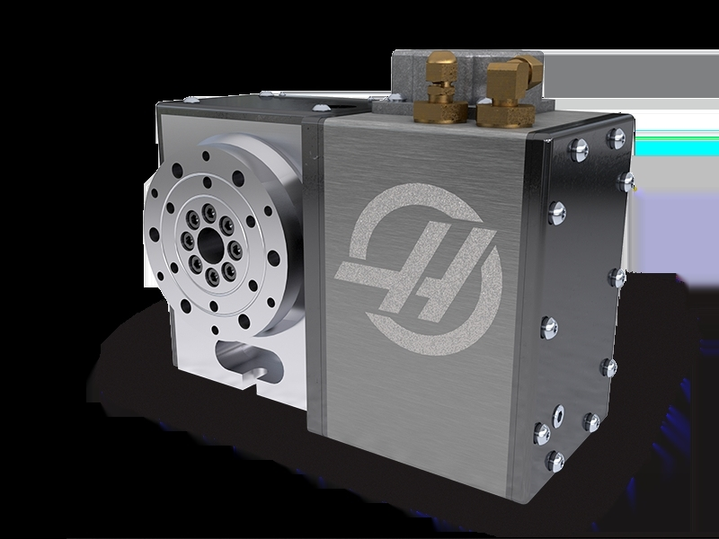
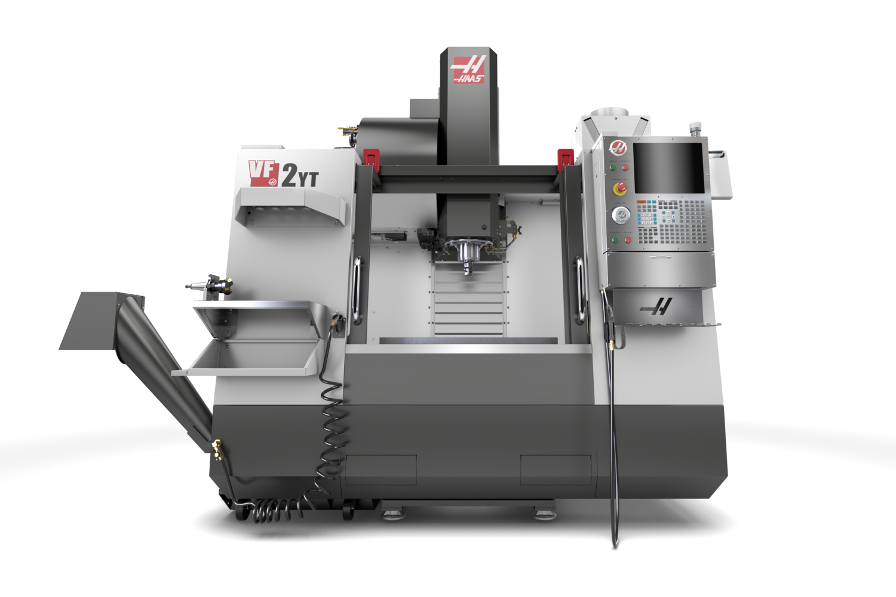
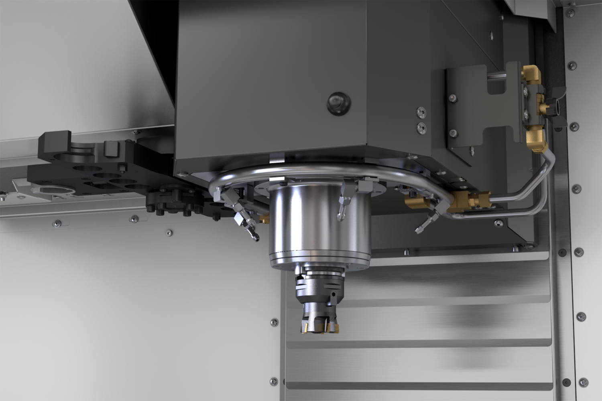
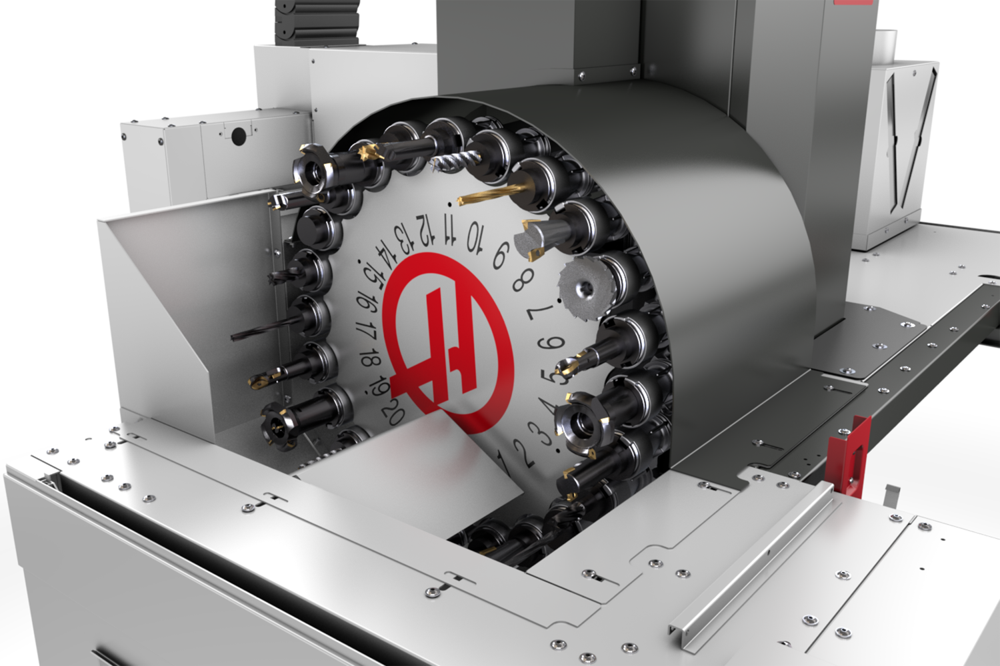

## Introduce of another CAD software
数控转台是一种用于机械加工的设备，它可以通过电脑控制来实现工件在不同方向上的旋转和定位。数控转台通常由转台主轴、伺服电机、编码器、控制系统等组成。它广泛应用于机械加工领域，特别是在数控机床、激光加工、雕刻等领域中起着重要作用。数控转台可以实现高精度的定位和旋转，提高加工效率和精度。

**数控转台的主要特点和功能包括：**

1. 电脑控制：数控转台可以通过电脑控制，实现精确的定位和旋转操作。

2. 多方向旋转：数控转台可以在不同方向上进行旋转，包括水平轴和铅垂轴的旋转。

3. 高精度定位：数控转台可以实现高精度的定位，最小增量可以达到0.001度。

4. 提高加工效率：数控转台可以实现自动化操作，提高加工效率和生产效率。

5. 提高加工精度：数控转台的高精度定位和旋转功能可以提高加工精度，保证产品质量。

**发展历史**

数控转台的发展历史可以追溯到数控技术的起源。数控转台是一种用数字代码形式的信息控制刀具进行自动加工的机床，它具有广泛的适应性和高精度加工能力。以下是数控转台的发展历史概述：
1.  1948年至1957年：数控技术的起源 

    1948年，美国帕森斯公司开始研制飞机螺旋桨叶片轮廓样板的加工设备，提出了计算机控制机床的设想

    1952年，该公司试制成功第一台由大型立式仿形铣床改装而成的三坐标数控铣床，并开始正式生产

    1957年，数控机床正式投入使用，标志着数控加工时代的开始

2.  1958年至1965年：数控技术在中国的发展

    1958年，中国开始研制数控机床，并成功试制出配有电子管数控系统的数控机床

    1965年，中国开始批量生产配有晶体管数控系统的三坐标数控铣床

3.  1960年至1974年：数控技术的进一步发展

    1960年以后，点位控制数控钻床和直线控制数控铣床得到较快发展，数控机床在机械制造业各部门逐步推广

    1974年，出现了第五代数控系统，采用微处理器和半导体存储器，功能扩大、体积缩小、价格降低，可靠性提高

4.  1980年至今：数控技术的现代化发展

    1980年代初，随着计算机软硬件技术的发展，数控装置能进行人机对话式自动编制程序，数控机床的自动化程度进一步提高

    目前，数控转台已经实现了计算机控制并在工业界得到广泛应用，适用于各种金属切削加工工艺和特种加工工艺

总结：
数控转台的发展历史经历了数控技术的起源、中国的发展、技术的进一步发展以及现代化发展阶段。随着计算机技术的不断进步，数控转台在加工领域的应用越来越广泛，为工件的高精度加工提供了有效的解决方案。

**以下是较新的数控转台型号和技术：**

1.HRT100 (https://www.haascnc.com/zh/machines/rotaries-indexers/rotary-tables/models/hrt100.html)

超紧凑型HRT100旋转工作台为在Haas CM-1紧凑型铣床和其他小型机床上加工小零件提供高速、精确的定位和全4轴运动。单元非常小的尺寸和重量轻，使其成为完美的4轴解决方案。

2.VF-2YT-V(https://www.haascnc.com/machines/vertical-mills/vf-series/models/small/vf-2yt-v.html)

-大功率直接传动主轴
-30+1侧装工具更换器
-可根据需要定制

------
