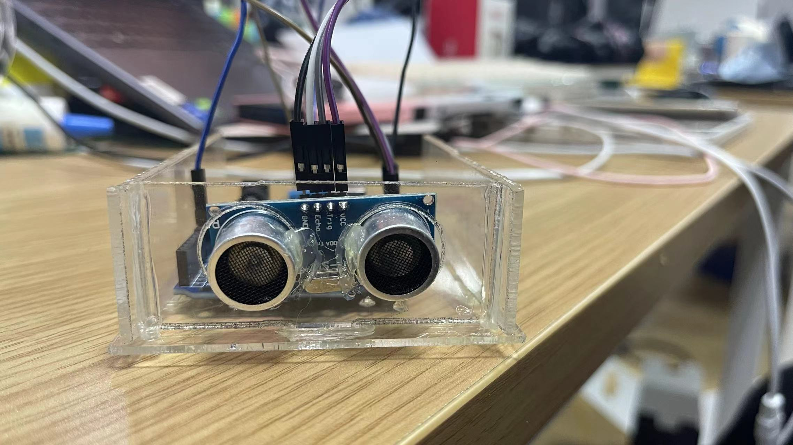

## Laser cutting introduction

**Materials that Laser Cutting Machines Can Process**

A laser cutting machine is a device that utilizes a laser beam to precisely cut materials. Laser cutting technology is commonly applicable to various types of materials, including both metals and non-metals. The following is a range of materials that laser cutting machines can typically process:

1. Metal Materials:
    a. Steel: Different types of steel, including stainless steel and carbon steel.
    b. Aluminum: Various aluminum alloys.
    c. Copper and Brass: Laser cutting is also effective for these materials.

2. Non-Metal Materials:
    a. Plastics: Examples include acrylic, polyester, polyethylene, etc.
    b. Wood: Laser cutting can be applied to wood and composite materials.
    c. Rubber: Various types of rubber.
    d. Paper and Textiles: Suitable for creating intricate patterns and designs.

3. Organic Materials:
    a. Leather: Both genuine leather and synthetic leather.
    b. Fabrics: Different types of fabrics and textiles.

4. Other Materials:
    a. Ceramics: Laser cutting can be applied to certain specific types of ceramics.
    b. Glass: Some laser systems can cut glass to a certain extent.

**Operating Procedures for Laser Cutting Machines**

1. Design Rules:

    a. Line Width: Consider the diameter of the laser beam in the design, ensuring that the lines are wide enough to accommodate the thermal effects and laser beam diameter during cutting. Typically, the recommended line width is not less than twice the diameter of the laser beam.

    b. Material Selection: Different materials have varying adaptabilities to laser cutting. Ensure the chosen material is suitable for laser cutting and understand its melting point and cutting characteristics.
    c. Material Thickness: Laser cutting machines have limitations on the maximum cutting thickness for different materials. Ensure the designed material thickness is within the specifications of the laser cutting machine.
    d. Hole Diameter and Spacing: When designing holes, consider the laser beam diameter, material type, and thickness. Too small holes may result in inaccurate cutting, while excessively large holes may compromise material strength.
    e. Internal and External Contours: Design of internal and external contours should consider factors such as cutting speed and focal length. Ensure there are no sharp internal corners in the design to avoid focus-related issues.
    f. Marking and Labeling: If marking or engraving text, icons, etc., on the material is needed, ensure these design elements are clearly visible during the cutting process.
    g. File Format and Layer Settings: Use compatible file formats (usually vector graphics) and ensure correct layer settings. Separate cutting and non-cutting lines, creating different layers for various cutting tasks.
    h. Focus Adjustment: Adjust the focus position of the laser cutting machine according to the type and thickness of the cutting material. Correct focus positioning helps achieve clear and precise cutting.
    i. Avoiding Reflections: Avoid surfaces in the design that may cause reflections, as this can interfere with the laser cutting machine's sensors and optical systems.
    j. Optimize Nesting: For batch production, optimizing nesting can minimize material waste and enhance production efficiency.

2. Types of Cuts:

    a. Material Thickness: Choose an appropriate material thickness based on the capabilities of the laser cutting machine. Generally, laser cutting machines have specific limits on the thickness of materials they can handle.

    b. Minimum Feature Size: When designing, consider the width of the laser beam. Typically, the minimum feature size of the cut should not be less than half the material thickness.
    
    c. Gaps and Bridges: When designing interlocking or assembled parts, consider appropriate gaps. Gaps should be slightly larger than around 1% of the material thickness.
    
    d. Internal Corner Treatment: Sharp internal corners may cause overheating and damage to the material. Use filleted corners in the design to reduce this risk.
    
    e. Heat-Affected Zone (HAZ): The heat generated during laser cutting affects the material properties. Consider this in the design, especially for precision parts.
    
    f. Support Structures: When cutting large-area materials, design suitable support structures to prevent material bending or displacement due to gravity.

**Practical Design of Laser Cutting Machine**

1. Adjustment of Speed, Power, and Cutting Practice:
    
    a. Cut the word "回" while controlling two variables: speed (30-90) and max power (10-90).
   
   

    b. Adjust the cutting starting position.
   
   

    c. Perform the cutting process.

    

2. Assembly of Laser Cutting Machine with Arduino:
    
    a. Upload the design in DXF format.

    

    b. Set power and speed rates.

    

    c. Execute the cutting process.

    

    d. Error cases: Small dimensions, excessively wide borders leading to printing failures.

    

    

Final Results:

------
