## Tools

------

**docsify:**

Use docsify to dynamically convert Markdown files to html files

Refer to tutorials and resources:

https://docsify.js.org/#/

https://www.bilibili.com/video/BV1kT4y1T7wY?p=5&vd_source=bf7032daf3b223ec5c2e15d27712e0d6

Video Tutorial 1:

 

**Typora：**

The lightweight Markdown editor uses WYSIWYG editing to provide instant previews. You can also switch to source editing mode to edit markdown documents.

Refer to tutorials and resources:

https://typora.io/


## Process

------


#### **Pre-deployment**

1.Docsify needs the Node.js environment, and doc-sify needs to run in the software, so before you start learning docsify, you need to install the Node.js environment, which is very easy to install. Click to visit [official website](https://nodejs.org/en/), and press enter.

2.After the installation is complete, open the CMD command line window (win-dows platform) and enter 'node' to run 'Node.js'. The following message indicates that the installation is successful:

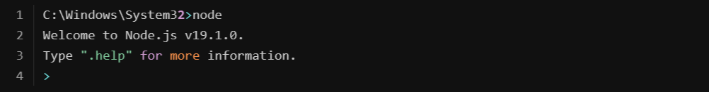

3.Then install docsify 'and continue typing in the CMD command line window:**npm i docsify-cli -g**

4.After the installation is successful, start initializing the docsify project

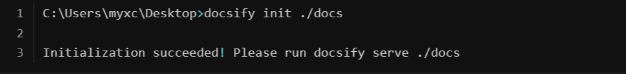

5.Open your PC browser and visit the local port on your PC [http://localhost:3000](http://localhost:3000/)to open the home page of Create Project

#### **Go to VS Code**
Open the project folder with VS code in the following directory and edit the 'README.md' file.

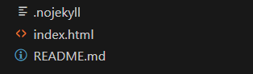


#### **Sidebar deployment**

1.The sidebar setup must first create a '_sidebar.md' file and then write:

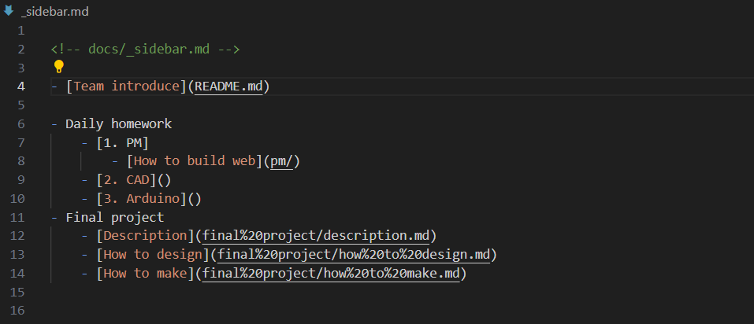

2.Then add Settings in 'index.html' :

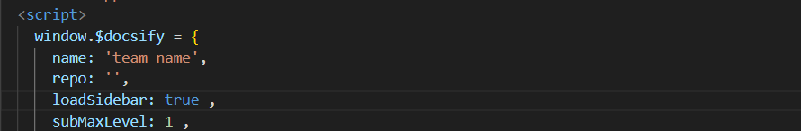

3.Write the directory link in the _sidebar.md file:


The folder hierarchy is as follows:

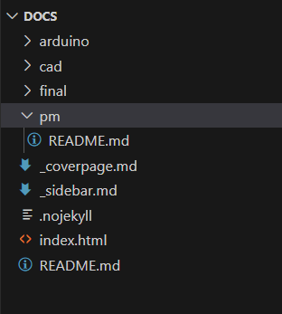


#### **Coverpage**

1.To open the home page, add the following in the index:**coverpage: true**

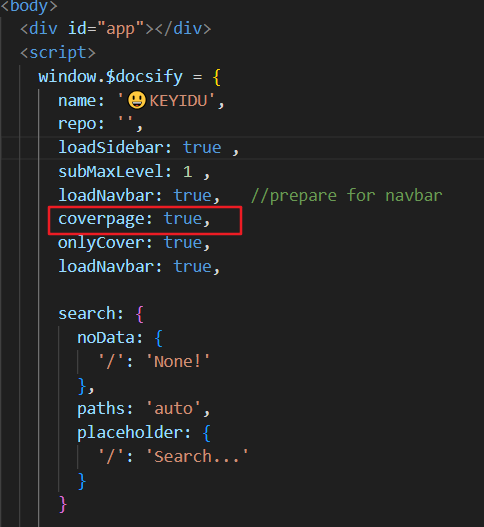

Location of coverypage.md:

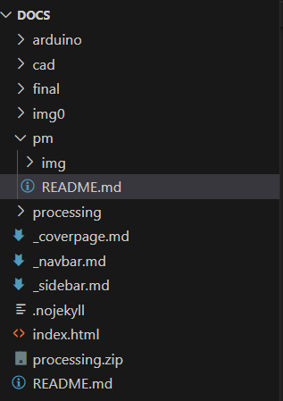

2.Create a '_coverpage.md' file and write:

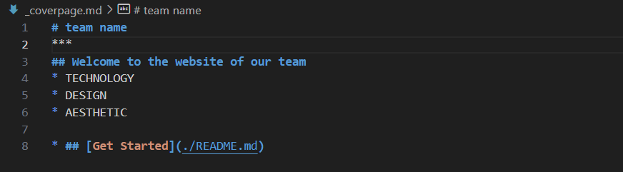

#### **Page beautification**

Style choice:

There are four official themes that only need to be introduced in index to be used:

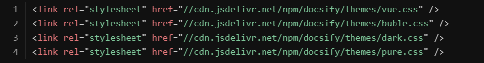

We chose the theme "blue", so we added the following code to the index to run this page beautification:

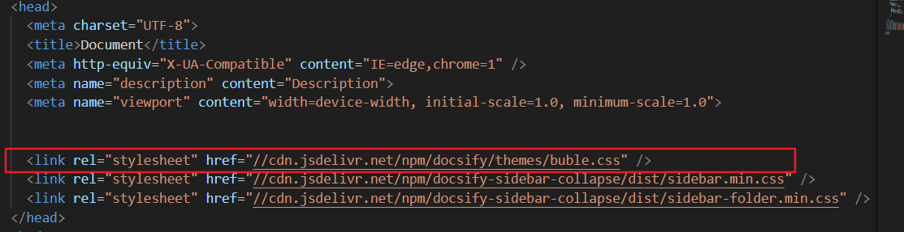

#### **Local setting**

1.Download the github client and register

2.Try to find the repository on the client and copy it locally

3.Open the local file with vscode and edit it

4.Update the file and push it to the web page

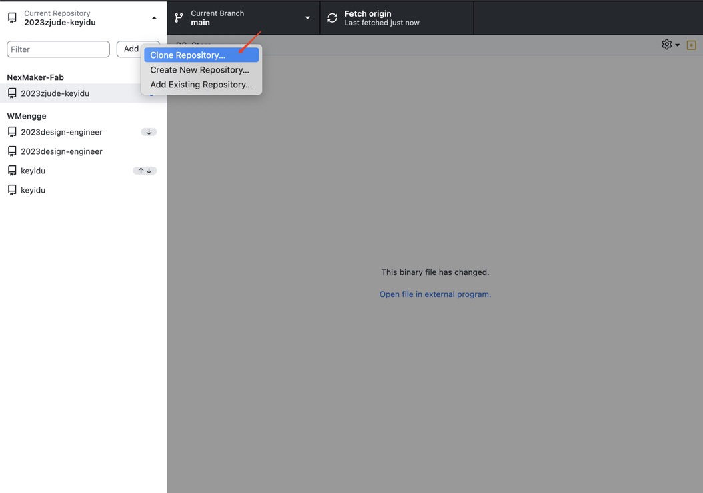

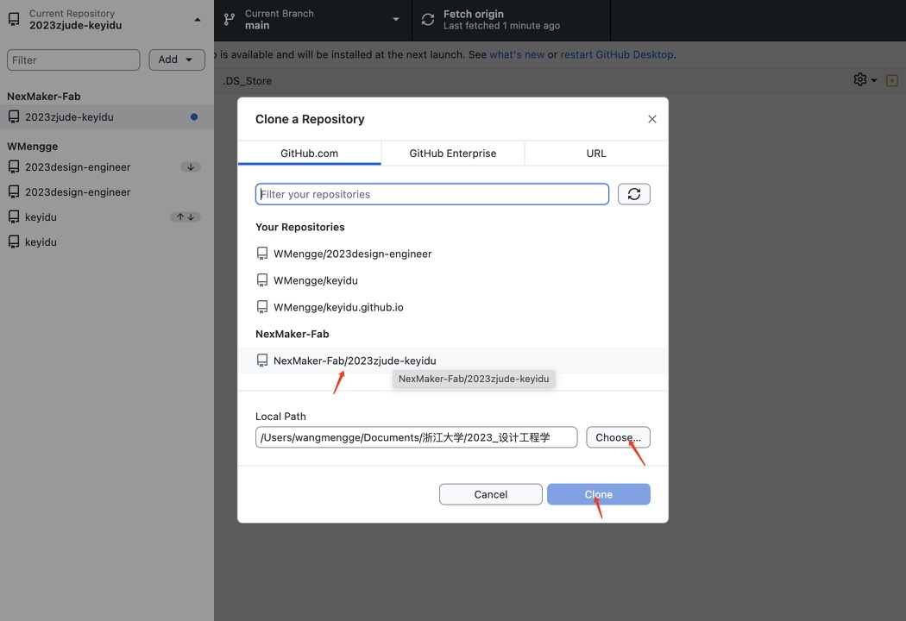

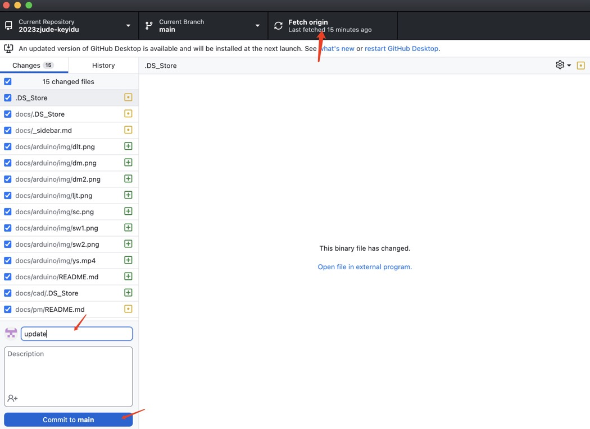

------


## **General interface layout**

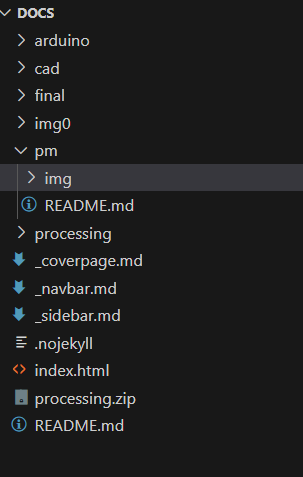

## **html document**
```
<!DOCTYPE html>
<html lang="en">
<head>
  <meta charset="UTF-8">
  <title>Document</title>
  <meta http-equiv="X-UA-Compatible" content="IE=edge,chrome=1" />
  <meta name="description" content="Description">
  <meta name="viewport" content="width=device-width, initial-scale=1.0, minimum-scale=1.0">
  
 
  <link rel="stylesheet" href="//cdn.jsdelivr.net/npm/docsify/themes/buble.css" />
  <link rel="stylesheet" href="//cdn.jsdelivr.net/npm/docsify-sidebar-collapse/dist/sidebar.min.css" />
  <link rel="stylesheet" href="//cdn.jsdelivr.net/npm/docsify-sidebar-collapse/dist/sidebar-folder.min.css" />
</head>
<body>
  <div id="app"></div>
  <script>
    window.$docsify = {
      name: '😃KEYIDU',
      repo: '',
      loadSidebar: true ,
      subMaxLevel: 1 ,
      loadNavbar: true,   //prepare for navbar
      coverpage: true,
      onlyCover: true,
      loadNavbar: true,
      
      search: {
        noData: {
          '/': 'None!'
        },
        paths: 'auto',
        placeholder: {
          '/': 'Search...'
        }
      }
     
    }
  </script>
  <!-- Docsify v4 -->
  <script src="//cdn.jsdelivr.net/npm/docsify@4"></script>
  <script src="//cdn.jsdelivr.net/npm/docsify/lib/plugins/search.min.js"></script>
  <script src="//cdn.jsdelivr.net/npm/docsify-sidebar-collapse/dist/docsify-sidebar-collapse.min.js"></script>
  <script src="//cdn.jsdelivr.net/npm/docsify/lib/plugins/emoji.min.js"></script>

</body>
</html>
```

## Problem and solution

------

1.Jump page level problem:

In the early stage, the sidebar page could not jump due to the editing error of the level. After understanding the relationship between the relative levels, I corrected it.


2.Picture problem:
The image cannot be loaded because the local image file address is directly added. After referring to the structure of other people's works, re-establish the picture management folder and change the picture address.

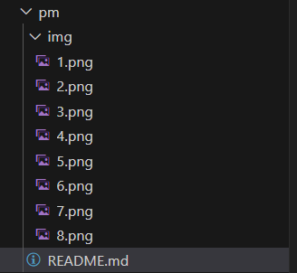

3.How to insert video:
The same way you inserted the photo, but with the file suffix changed to 'mp4'. And limit the size of the video.


