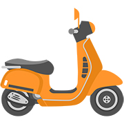
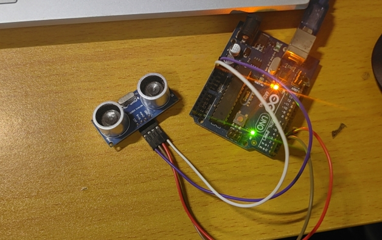
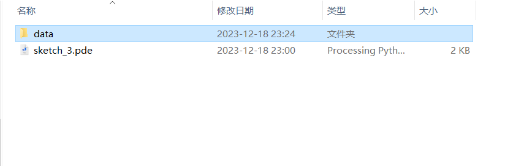
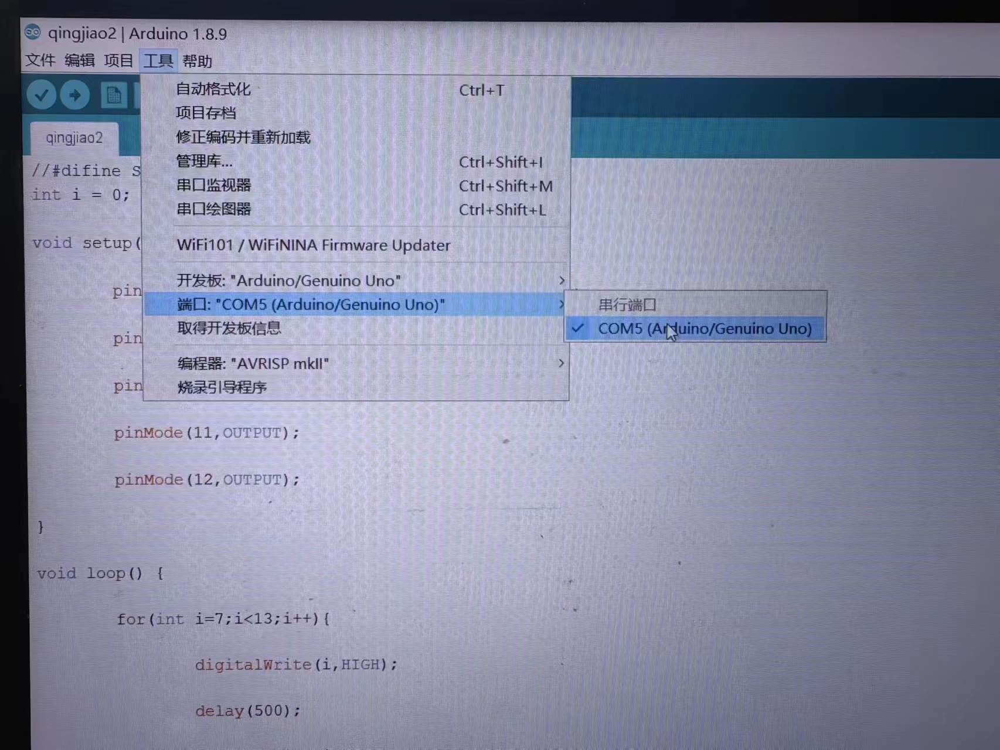
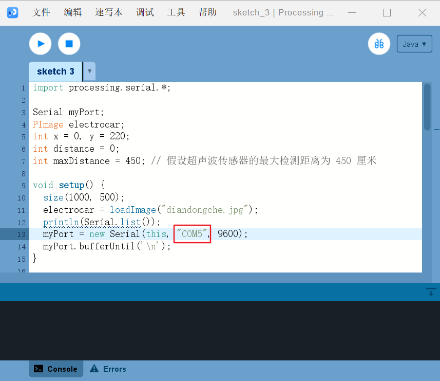
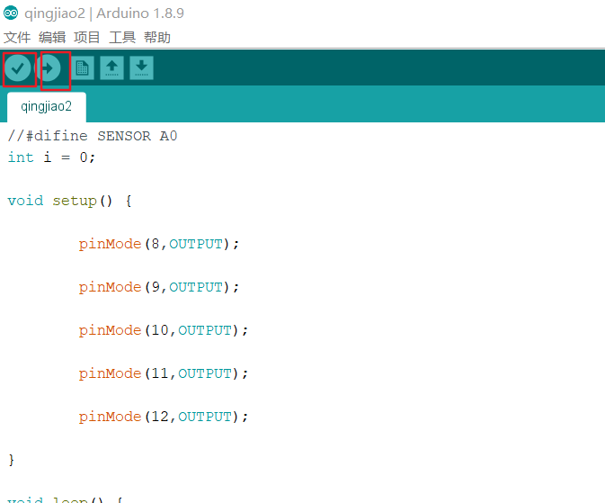
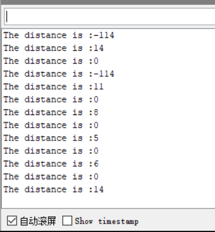
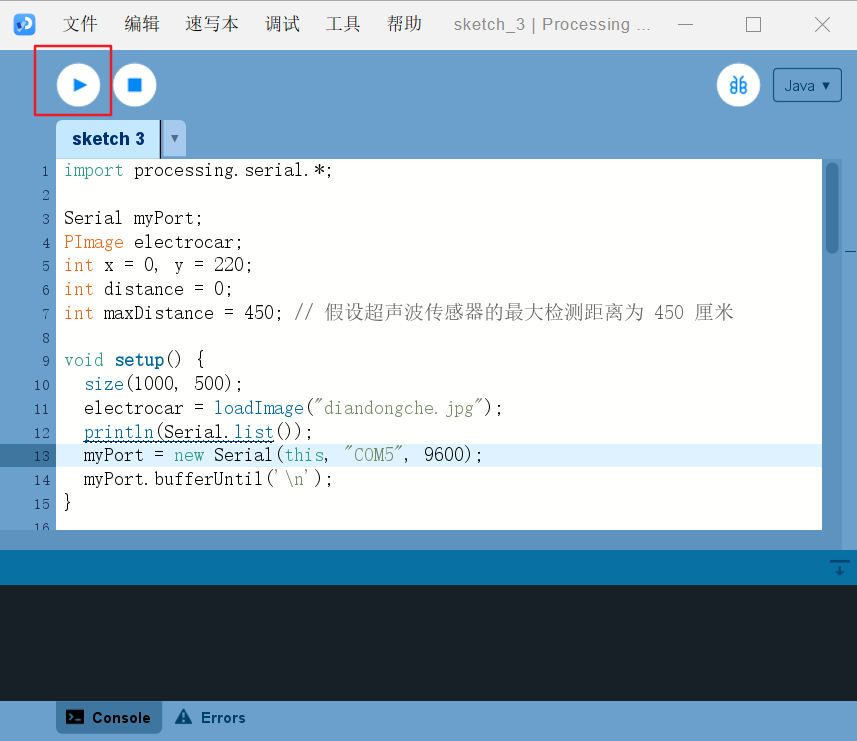

## Ultrasonic sensor controlled trolley

### Tools

1. **Ultrasonic sensor**:
   - Used to measure the distance to an obstacle in front of you, determining the distance by sending a sound wave and receiving its return.
2. **Cart Picture**:
   - Represents a graphical representation of an electric car moving in the Processing programme.
   
   
3. **Arduino & Processing**:
   - Arduino is used to control the ultrasonic sensor and send the data to the computer.
   - Processing is used to receive the distance data sent by Arduino and graphically represent the movement of the cart picture.

### Implementation results

1**. Schematic Description**:

- This project uses the distance data detected by the ultrasonic sensor to control the lateral position of the cart picture in the Processing programme. When the distance detected by the sensor decreases, the car picture moves to the right on the screen and vice versa. This way simulates the effect of a real cart moving according to the distance of an obstacle.

2.** Video presentation**:

 


### Implementation process

#### 1.Arduino part: ultrasonic sensor reading distance

**Sensor Connection:**

- Connect the Trig port of the ultrasonic sensor to the digital output pin of the Arduino (e.g. D2).
- Connect the Echo port to the Arduino's digital input pin (e.g. D3).
- Provide appropriate power and ground connections for the ultrasonic sensor.


**Arduino code:**

- The Arduino program initialises the serial communication and sets the pin patterns used for Trig and Echo.
- In a loop, the Arduino triggers the sensor to emit sound waves and then reads the pulse width on the Echo pin.
- The pulse width is converted to distance and sent to the connected computer via the serial port.

The code is as follows：

```

int outputPin =2;              //接超声波Trig到数字D2脚
int inputPin =3;               //接超声波Echo到数字D3脚

void setup()
{
  Serial.begin(9600);
  pinMode(inputPin,INPUT);
  pinMode(outputPin,OUTPUT);
}

void loop()
{
  digitalWrite(outputPin,LOW);
  delayMicroseconds(2);
  digitalWrite(outputPin,HIGH);//发出持续时间为10微秒到Trig脚驱动超声波检测
  delayMicroseconds(10);
  digitalWrite(outputPin,LOW);
  int distance =pulseIn(inputPin,HIGH);   //接收脉冲的时间
  distance =distance/58;                  //将脉冲时间转换为距离值
  Serial.print("The distance is :");      
  Serial.println(distance);
  delay(50);
}
```

#### 2. Processing part: presenting the picture of the cart, controlling the cart away from or close to the wall

**Graphical Interface**:

- Use Processing to create a window for presenting the cart picture and other graphical elements (e.g. distance indication).
- Read the distance data sent by the Arduino via serial communication.

**Code Implementation**:

- Load the cart picture in `setup()` and initialise serial communication.

- Calculate the x-coordinate of the cart image from the read distance value in `draw()` and draw it on the window.

- Use the `serialEvent()` function to handle the serial data received from the Arduino.

  The code is as follows:

```
import processing.serial.*;

Serial myPort;
PImage electrocar;
int x = 0, y = 220;
int distance = 0;
int maxDistance = 450; // 假设超声波传感器的最大检测距离为 450 厘米

void setup() {
  size(1000, 500);
  electrocar = loadImage("diandongche.jpg");
  println(Serial.list());
  myPort = new Serial(this, "COM3", 9600);
  myPort.bufferUntil('\n');
}

void draw() {
  background(255);
  fill(30, 40, 40);
  rect(990, 80, 10, 395);

  // 确保 distance 值在预期的范围内
  println("Distance read from sensor: " + distance);

  // 如果距离值有效（例如，超声波传感器的最小和最大值）
  if (distance > 0 && distance <= maxDistance) {
    // 图片应当从画布的右边界开始向左移动，距离越小，图片越向右
    x =(int) map(distance, 0, maxDistance, width - electrocar.width, 0);
  }

  // 确保 x 坐标在预期的范围内
  println("Mapped x coordinate: " + x);

  image(electrocar, x, y);
  text("Distance is " + distance + " CM", 250, 50);
}

void serialEvent(Serial myPort) {
  String inString = myPort.readStringUntil('\n');
  if (inString != null) {
    inString = trim(inString); // 删除字符串两端的空白字符
    println("Received string: " + inString); // 打印接收到的字符串，用于调试
    // 分割字符串以获取数字部分
    String[] parts = split(inString, ':');
    if (parts.length > 1) {
      String distanceStr = parts[parts.length - 1].trim(); // 获取最后一个部分，即数字
      try {
        distance = int(distanceStr); // 将数字字符串转换为整数
        println("Parsed distance: " + distance);
      } catch (Exception e) {
        println("Error parsing the distance: " + distanceStr);
      }
    }
  }
}`
```

**The processing code and image folders are as follows**



And put "diandongche.jpg" in the "data" folder


### Overall operation process:

**First connect the arduino, pay attention to the serial port of arduino and processing should be consistent**






**Code input, verify first, no error after upload**




**Serial port monitor contents are as follows:**




**Then open processing, enter the code and run**




